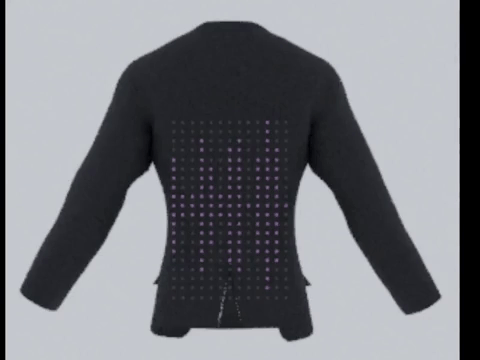

# Project-Y
### Project Y is a display shirt that lights up to audio frequency   

 
 
 
 

### Build commands:
     cmake -S [source] -B [build] ([] represents folders)
     MSBuild.exe /build/path/from/above/ProjectName.sln
     ProjectName.exe (again in their respected debug folder)

 

# Development roadmap
## Phase 1:
1. <strike>Figure out unit testing in C++</strike>
2. <strike>Bare minimum code implementation</strike>
3. <strike>Static pattern</strike>
4. <strike>Document current pitch</strike>
5. <strike>3D model a prototype (shirt and animations in Blender)</strike>
6. Requirement analysis (hardware and safety precautions)

## Phase 2:
7. Refactor (see TODO in devlog)
8. Distribute frequencies over LED vectors
9. Add FTT Analysis
10. Make reactive equalizer pattern strategy

## Phase 3:
11. 3D print case
12. 3D print holder
13. Product assembly
14. sound wave pattern
15. 2x2 pixel grid (integrate subpixels)