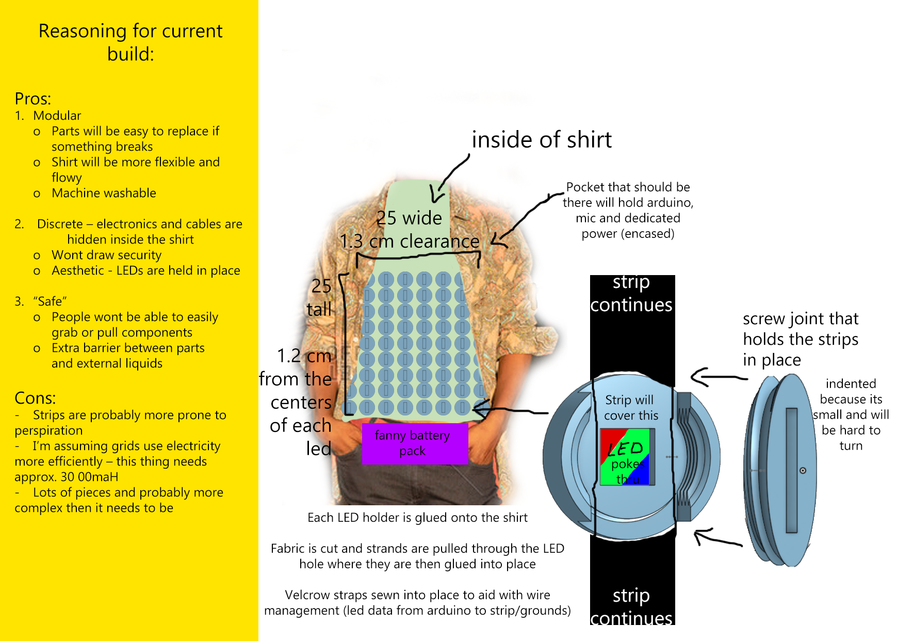

<div align=center>

# Project-Y
### Project Y is a display shirt that lights up to audio frequency  

</div>
<br>
<br>

<div align=right>


</div>

<br>
<br>

# Managing patterns:
Using SOLID principles and the strategy design pattern, creating patterns is a relatively straighforward process:

1. Make use of the [LEDDisplay](https://github.com/DaneHarrison/Project-Y/blob/main/src/Objects/LEDDisplay.h) classes to implement the [strategy base class](https://github.com/DaneHarrison/Project-Y/blob/main/src/Interfaces/PatternStrategy.h):
     - [LEDGrid](https://github.com/DaneHarrison/Project-Y/blob/main/src/Objects/LEDGrid.h)
     - [LEDStrip](https://github.com/DaneHarrison/Project-Y/blob/main/src/Objects/LEDStrip.cpp)

2. Add strategy to [VisualizerLogic](https://github.com/DaneHarrison/Project-Y/blob/main/src/Logic/VisualizerLogic.h)

<br>

# Build

### Commands:
- ```cmake -S [source] -B [build] ([] represents folders)```
- ```MSBuild.exe /build/path/from/above/ProjectName.sln```
- ```ProjectName.exe (again in their respected debug folder)```

### Physical:
